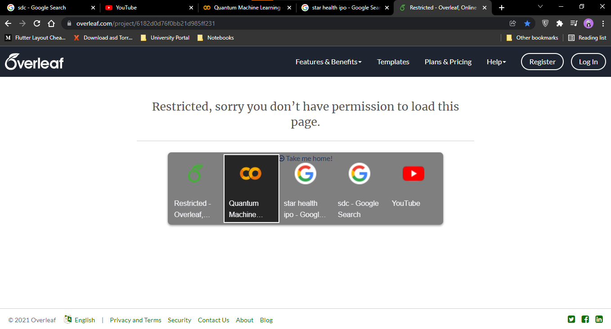

# AltQ
Trying to mimic the CTRL+TAB behavior of firefox on Chrome

Alt + Q to traverse forward in tabs
Alt + W to traverse backward in tabs

1. Supports multiple windows of chrome browser
2. Encode all tab data and can be decoded and copied any other device to get all tabs.
3. Skips youtube ads.
